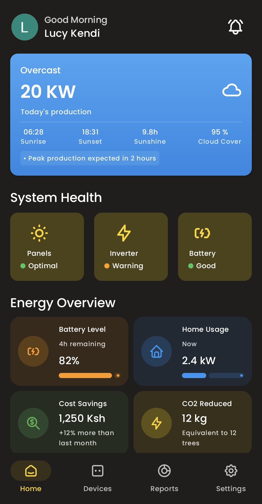
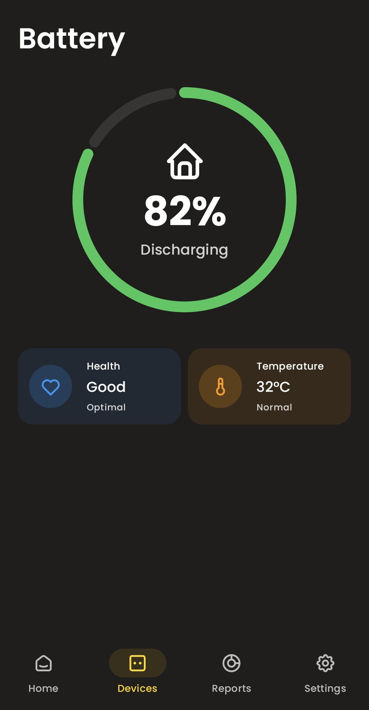

# SolarEase: Android App for IoT Solar Monitoring

SolarEase brings together Android, IoT and Cloud services to enable real-time monitoring of solar installations in home setups.

## Key Highlights
- **Multi-Brand Support**: Custom ESP32 board with switchable MAX232 level-shifting. Works with RS-232 or TTL-232 inverter/charge controller and a WiFi network. Currently, 2 brands have been tested out. Incorporation of more brands is a work in progress.
- **Live Metrics & Historical Reports**: Voltage, current, power output, temperature updated every 10 seconds. Daily, weekly and monthly energy displayed through charts.
- **Weather Integration**: Local cloud-cover, temperature and solar irradiance data. 3-day forecast to help plan energy usage.
- **Offline support**: In-memory TTL caching keeps data info available for up to an hour without intenet connectivity, and auto-syncs when internet connection is restored.

## Simplified System Architecture

## Tech Stack
-   **Android**: Kotlin + Jetpack Compose
-   **Firmware**: C (ESP32, MAX232)
-   **Cloud**: Firebase Auth & Firestore, Azure IoT Hub & Functions
-   **APIs**: Open-Meteo for weather
-   **Tools**: Retrofit, Dagger Hilt, Coroutines

## Screenshots

<table>
  <tr>
    <td></td>
    <td></td>
    <td></td>
  </tr>
  <tr>
    <td></td>
    <td></td>
    <td></td>
  </tr>
  <tr>
    <td></td>
    <td></td>
    <td></td>
  </tr>
</table>
